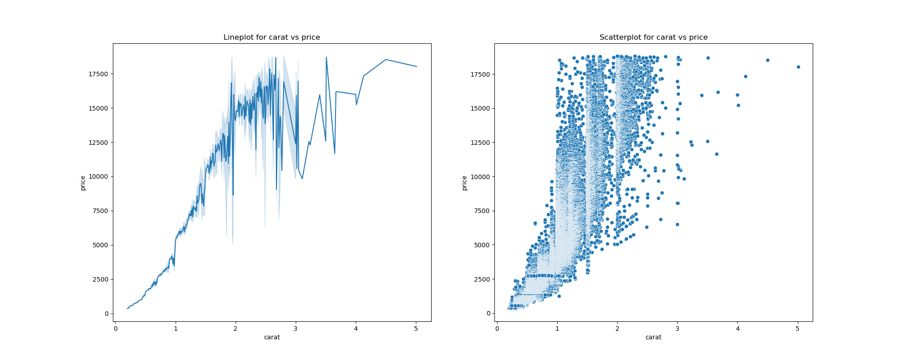
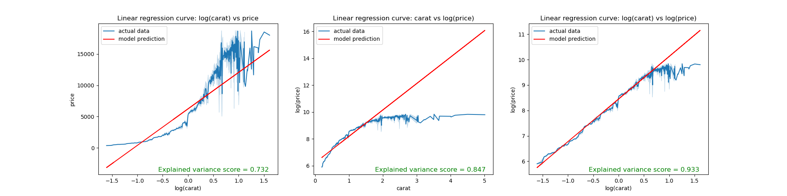
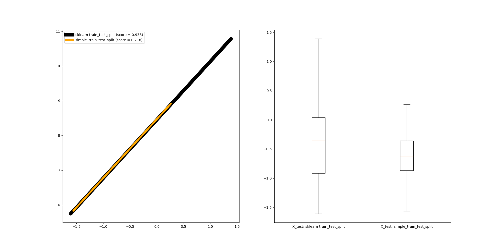

# hw-diamonds

## Assignment

Use the [diamonds dataset](https://ggplot2.tidyverse.org/reference/diamonds.html) to answer the questions below.
You can get the data directly from the "data-raw" directory in the [ggplot2 github repo](https://github.com/tidyverse/ggplot2/).

- Download the data into data folder using the following make command (each of the make command for file execution also includes downloading data).

```
make data/diamonds.csv
```

- All the user defined functions are written in `readit.py` and imported when necessary in the solution python files.

## Question 1

Visualize the relationship between "price" and "carat" and comment on the type of model that 
might be appropriate for modeling their relationship.

- The following make command to execute the `q1.py` file followed by the output plot.

```
make q1
```



- We can observe through both line and scatter plot that as the carat value increases, the price also tends to increase (price also depends on other factors). We can conlcude that the graph is changing in a linear fashion.
- So, I want to use a linear regression model to predict the price values using carat.


## Question 2

Investigate logarithmic transformations to see if you can find a more appropriate relationship
between "price" and "carat" for univariate linear regression.
Use data visualization to help justify your choice of model.
Use explained variance score as a metric for model performance, and report training scores based on the entire dataset.

- The following make command to execute the `q2.py` file followed by the output plot.

```
make q2
```



- Investigating with log transformations on different cases (individual cases and comined) to build univariate linear regression, we get the above plot.
- Plotting log(carat) vs price, we can see that the line plot is curved and the model built using *log(carat) as predictor to predict price has Explained variance score is 0.732*. Plotting carat vs log(price), we can see that the line plot here is also curved and the model built using *carat as predictor to predict log(price) has Explained variance score is 0.847*.
- Plotting log(carat) vs log(price), we can see the line plot is linear and the model built using ***log(carat) as predictor to predict log(price) has Explained variance score is 0.933***.
-   Seeing the visual `Linear regression curve: log(carat) vs log(price)`, we can see that our choice of using linear regression becomes more obvious. And using log(carat) to predict log(price) to build univariate linear regression gives us an explained variance score of 0.933 (the best among three). Using log(carat) and log(price) gives us an almost linear plot, thus, justifying our choice.

## Question 3

Use the `simple_train_test_split` function below and `sklearn.model_selection.train_test_split` 
to evaluate the explained variance of the univariate model using the testing dataset.
Use explained variance as a metric for model performance.
Describe the results and create a visualization that helps explain the differences between the two approaches.
```
def simple_train_test_split(X, y, test_size=.3):
    n_training_samples = int((1.0 - test_size) * X.shape[0])

    X_train = X[:n_training_samples,:]
    y_train = y[:n_training_samples]

    X_test = X[n_training_samples:,:]
    y_test = y[n_training_samples:]

    return X_train, X_test, y_train, y_test
```

- The following make command to execute the `q3.py` file followed by the output plot.

```
make q3
```



- Using `sklearn.model_selection.train_test_split` gives us an explained variance score of 0.933. However, using the user defined function `simple_train_test_split` gives us an explained variance score of 0.718.
- We can observe the line plot of 'X_test vs y_pred' for both models is linear. However, the range of values of X_test returned by *simple_train_test_split* has less value range (-1.5 to 0.25 approx)compared to the one returned by *sklearn.model_selection.train_test_split* (-1.5 to 1.5 approx).
- The parameter shuffle in *sklearn.model_selection.train_test_split* by default is `True`. This shuffles the data and allows the train and test data to be random and well distributed. Since this is absent in *simple_train_test_split*, there is no shuffle happening and the distribution is resticted.
- When you set `shuffle=False` for `sklearn.model_selection.train_test_split`, we can observe that we get an explained vatiance score of 0.718 which is further proof that shuffle makes the difference in these two functions

## Question 4

Use one-hot encoding to find the best 2-input model by adding either "cut", "color" or "clarity" as a second predictor along with "log(carat)" to model "log(price)". Which 2-input model has the best performance? Report the training score
with explained variance metric, using the entire dataset for both training and evaluation. Compare to the corresponding univariate model in question 2. What's the ".shape" of the feature matrix for the "best" model?

- The following make command to execute the `q4.py` file followed by the output.

```
make q4
```

```
Output:
-------
Explained variance score with cut: 0.9370963570189093
Explained variance score with color: 0.9453610273620657
Explained variance score with clarity: 0.9653665511320024
```

- We can observe that using log(carat), clarity as features to predict the price has the best explained variance score among the three.
- The ".shape" of the feature matrix for the "best" model is `(53940, 9)` (python code to print feature matrix shape is commented in the respective file).

## Question 5

Repeat the analysis of Question 4, this time using 5-fold cross validation.
Report both train and test scores (average +/- standard deviation).
Compare results here with those of Question 4.
Discuss results and explain any significant differences with Question 4.

- The following make command to execute the `q5.py` file followed by the output.

```
make q5
```

```
Output:
-------
FOR cut
-- Train scores: [0.94200379 0.93485978 0.91795193 0.93555893 0.94266146]
-- Test scores: [0.85965722 0.86476506 0.95589465 0.04188927 0.75985869]
-- mean train score 0.934607180325416
-- mean test score 0.6964129777861421
-- train score standard deviation 0.008921301772608711
-- test score standard deviation 0.3330911255311681
-- Mean train score +/- std error :  0.935 +/-  0.009
-- Mean test score +/- std error :  0.696 +/-  0.333

FOR color
-- Train scores: [0.95042834 0.94171256 0.9279859  0.94543943 0.95059399]
-- Test scores: [0.86528424 0.89261124 0.96180175 0.09022118 0.78044323]
-- mean train score 0.9432320439385634
-- mean test score 0.7180723301989499
-- train score standard deviation 0.008313979053359026
-- test score standard deviation 0.3192573913059096
-- Mean train score +/- std error :  0.943 +/-  0.008
-- Mean test score +/- std error :  0.718 +/-  0.319

FOR clarity
-- Train scores: [0.96817891 0.96406405 0.95341276 0.96431196 0.96894176]
-- Test scores: [0.92223134 0.92622136 0.97852336 0.49278478 0.85495433]
-- mean train score 0.9637818873043006
-- mean test score 0.8349430342137903
-- train score standard deviation 0.00554684700366917
-- test score standard deviation 0.17552151650461117
-- Mean train score +/- std error :  0.964 +/-  0.006
-- Mean test score +/- std error :  0.835 +/-  0.176
```

- The average training scores of each of 'cut, color and clarity' are almost equal to the result achieved in question4.
- However, the average test scores are not as good as the train scores for each of them. Using features `log(carat) and clarity` to predict price has the best train and test scores among the three with `log(carat) and cut` being the worst.
